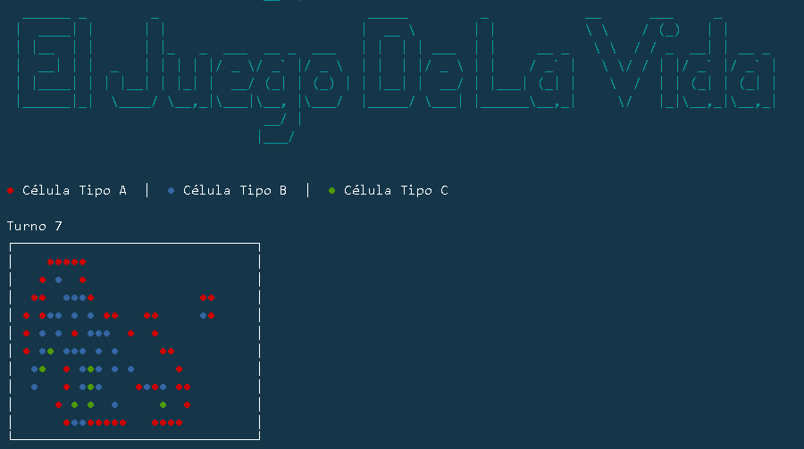

# GAME OF LIFE
Implementation of Conway's Game of Life in C++. The Game of Life is a cellular automaton.

The "game" is a zero-player game, it's evolution is determined by its initial state, requiring no further input. 
One interacts with the Game of Life by creating an initial configuration and observing how it evolves, or, for advanced "players", by creating patterns with particular properties.

## Author
Ángel Luis Igareta Herráiz

## INDEX
* [Usage](#usage)
  * [Example workflow](#example-workflow)
* [License](#license)

## Usage
To play it first you have to compile the source with MakeFile. After that you can start the game executing:

```
.bin/lifegame
```
After that the game will prompt in spanish the dimensions of the board.


Finally you can choose to put the positions of the initial cells manually or randomly.
### Example workflow
If we choose a board of 10 of height and 30 of width, the result would be:


## License
The Mit License.